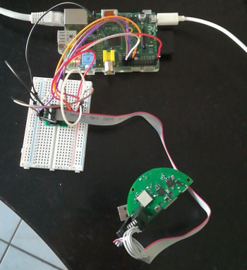

# Introduction

This repo contains information about the [IKEA Tradfri gateway](https://www.ikea.com/gb/en/p/tradfri-gateway-white-20337807/). This device interacts with a smartphone and an IKEA Tradfri light bulb. It allows the user to control brightness, color etc.

The COAP interface has been well-documented by [glenndehaan](https://github.com/glenndehaan/ikea-tradfri-coap-docs), so we will focus on the hardware of the device. We will also discuss about security issues that may be present.

# Hardware design


The circuit is pretty simple. There are four major chips
* The red one is a [EFR32MG1 SoC](https://www.silabs.com/documents/public/data-sheets/efr32mg1-datasheet.pdf). Based on an ARM M4. Very common SoC for IoT devices. This chip is [ZigBee](https://en.wikipedia.org/wiki/Zigbee) compatible. The gateway communicates with the bulb using this protocol.
* The blue one is a [BCM5241](https://www.broadcom.com/products/ethernet-connectivity/copper-phy/fe-phy/bcm5241). This is just the chips that allow the SoC to interact with the RJ45 connector.
* The green one is [Maruta Type 1GC](https://wireless.murata.com/type1gc.html). This is the chip that handles wifi.
* The orange one is a [IS25CQ032](http://ams.issi.com/WW/pdf/25CQ032.pdf). This is a 32Mb NOR flash.

In terms of connectivity, there are a RJ45 connector - to connect the gateway to the local network - and a micro usb connector to power the device.

# NOR Dump
## First try
<p align="center">
  
</p>

To dump the NOR, I use a SOIC8 clip, a Raspberry Pi and a breadboard. A [SOIC8 clip](https://www.amazon.fr/ARCELI-Programmation-Circuit-EEPROM-adaptateurs/dp/B07BP7S3HD/ref=sr_1_3?__mk_fr_FR=%C3%85M%C3%85%C5%BD%C3%95%C3%91&keywords=soic8+clip&qid=1566493760&rnid=6828314031&s=gateway&sr=8-3) is a very handy equipment that is clipped to the chip. It avoids the soldering step.

> If you want more details on the circuit, don't hesitate to send me a message.

Now that the circuit is correct, I use [flashrom](https://www.flashrom.org/Flashrom) to dump the NOR. Unfortunately, the whole process is not very stable and often get error when trying to read the memory.
```
nico@raspberrypi:~ $ sudo flashrom -p linux_spi:dev=/dev/spidev0.0
flashrom v1.1-rc1-69-g188127e on Linux 4.14.62+ (armv6l)
flashrom is free software, get the source code at https://flashrom.org

Using clock_gettime for delay loops (clk_id: 1, resolution: 1ns).
Using default 2000kHz clock. Use 'spispeed' parameter to override.
No EEPROM/flash device found.
Note: flashrom can never write if the flash chip isn't found automatically.
```

But after few tries, I finally succeed to dump the NOR. Fire binwalk !
```
nico@poule: ~ $ binwalk dmp.bin 

DECIMAL       HEXADECIMAL     DESCRIPTION
--------------------------------------------------------------------------------
0             0x0             TRX firmware header, little endian, image size: 45716 bytes, CRC32: 0x0, flags: 0x60, version: 2, header size: 32 bytes, loader offset: 0xB270, linux kernel offset: 0x67E000, rootfs offset: 0x0, bin-header offset: 0x0
39888         0x9BD0          PEM certificate
40029         0x9C5D          PEM RSA private key
40091         0x9C9B          PEM EC private key
391045        0x5F785         Neighborly text, "Neighbor Report frame with incorrect length %dched token (%d, %d) on Neighbor Report frame"
391131        0x5F7DB         Neighborly text, "Neighbor Report frament with length %d"
391173        0x5F805         Neighborly text, "Neighbor Report element with length %dwl%d: %s: wlc_iem_add_build_fn failed, cap ie"
614400        0x96000         ELF, 32-bit LSB executable, ARM, version 1 (SYSV)
```

Cool ! TRX firmware header is a good hint that we are on the right track. But wait. There is no filesystem ? And why is the dump so small ? The dump is probably a partial dump of the NOR. We have to figure out why and fix the problem. Indeed, the dump is of size 4MB whereas the NOR is 32Mb (based on the datasheet).


# Next step
Find why we only got 4Mb out of the 32Mb NOR.