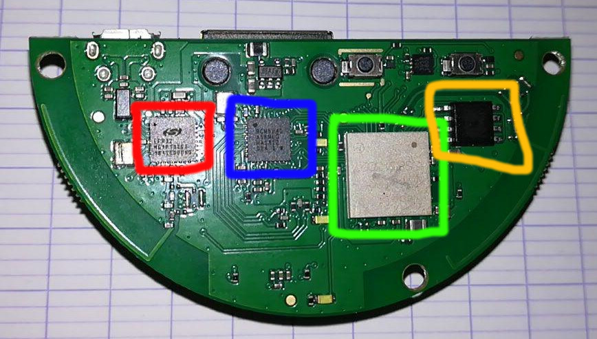

# Introduction

This repo contains information about the [IKEA Tradfri gateway](https://www.ikea.com/gb/en/p/tradfri-gateway-white-20337807/). This device interacts with a smartphone and an IKEA Tradfri light bulb. It allows the user to control brightness, color etc.

The COAP interface has been well-documented by [glenndehaan](https://github.com/glenndehaan/ikea-tradfri-coap-docs), so we will focus on the hardware of the device. We will also discuss about security issues that may be present.

# Hardware design

The circuit is pretty simple. There are four major chips
* The red one is a [EFR32MG1 SoC](https://www.silabs.com/documents/public/data-sheets/efr32mg1-datasheet.pdf). Based on an ARM M4. Very common SoC for IoT devices. This chip is [ZigBee](https://en.wikipedia.org/wiki/Zigbee) compatible. The gateway communicates with the bulb using this protocol.
* The blue one is a [BCM5241](https://www.broadcom.com/products/ethernet-connectivity/copper-phy/fe-phy/bcm5241). This is just the chips that allow the SoC to interact with the RJ45 connector.
* The green one is [Maruta Type 1GC](https://wireless.murata.com/type1gc.html). This is the chip that handles wifi.
* The orange one is a [IS25CQ032](http://ams.issi.com/WW/pdf/25CQ032.pdf). This is a 32Mb NOR flash.

In terms of connectivity, there are a RJ45 connector - to connect the gateway to the local network - and a micro usb connector to power the device.

# Next step
Now that we have a better understanding of the circuit, we will try to dump the NOR to see what is inside in term of operating system, application etc. But for that, we need to buy a NOR dumper/flasher and some soldering items. Wait and see :)